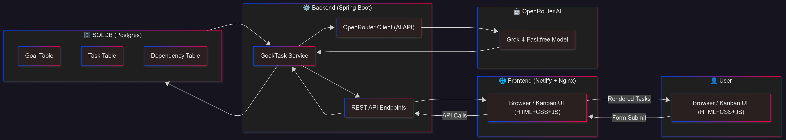
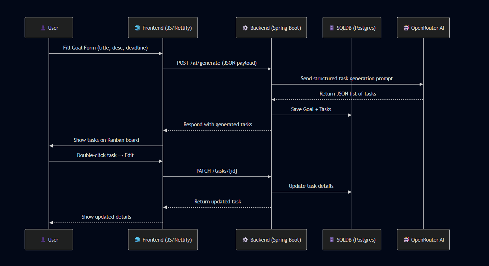
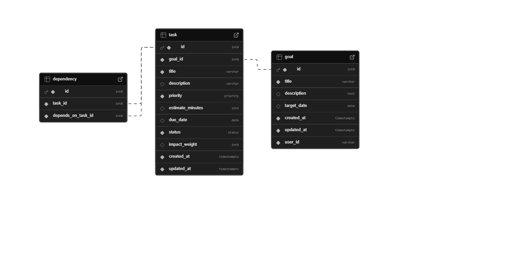
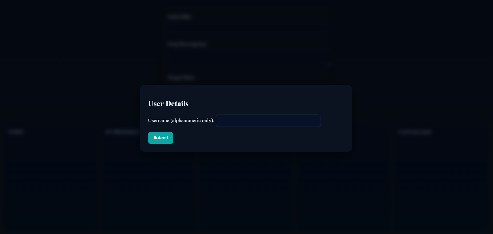
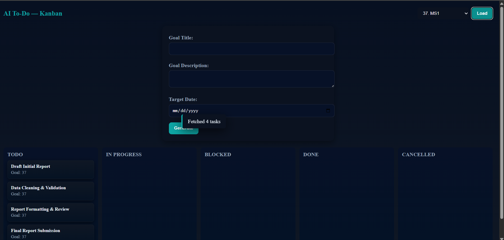
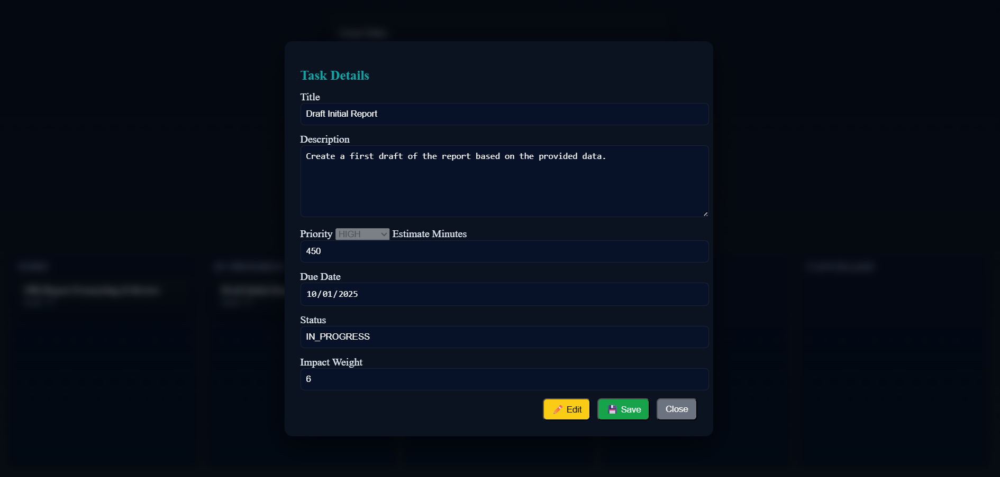

# AI-No-Pro (AI-Powered Task Planner)
AI-No-Pro is an AI-assisted no procrastination management app.  
It generates, organizes, and manages tasks automatically from user goals.
Note: This is public repository for representation of an in-progress project ai-no-pro.

- [`Features`](#features)

- [`Tech Stack`](#tech-stack)

- [ `Prompting`](#prompting) 

- [ `Architecture`](#architecture) 

- [`Data flow`](#data-flow)

- [`Snaps`](#snaps)

- [`Footer`](#collaboration)
---

## Features
- ✨ **AI-powered Task Generation** — converts a goal into a Kanban board of tasks.
- 📌 **Kanban Board** — drag & drop tasks across TODO / IN_PROGRESS / DONE / CANCELLED.
- 📝 **Task Editing** — edit title, description, priority, due dates.
- ⏲️ **Priority Bands** — visual priority cues (LOW, MEDIUM, HIGH, CRITICAL).
- ⏱ **Impact & Time Estimates** — helps prioritize effectively.
- 👤 **User-specific goals** — tasks are scoped by user.

---

## Tech Stack
### Frontend:
- HTML, CSS, JavaScript (Vanilla)
- Nginx (for static deployment)

### Backend (optional):
- Java + Spring Boot
- PostgreSQL (Render Postgres)

### AI Integration:
- OpenRouter (x-ai/grok-4-fast:free)

### Infra:
- **Frontend Deployment** → Netlify / GitHub Pages  
- **Backend Deployment** → Render (Dockerized Spring Boot)

---

## Architecture

**Flow:**
1. User inputs goal → AI generates structured tasks.
2. Backend stores tasks/goals → PostgreSQL DB.
3. Frontend renders Kanban UI with task management.
4. AI APIs (OpenRouter/HuggingFace) provide LLM responses.
---
## Prompting
This project primarily leverages `instruction-based prompting` combined with `structured output-constrained prompting`. The system prompt defines the role of the model as a task planner, while the user prompt injects context (goal, deadline, and constraints). The technique resembles a `light form of Chain-of-Thought prompting`, since the model is nudged to reason about why a task is needed and how it contributes to the goal before producing **structured JSON**. Additional constraints ensure outputs remain consistent (priority levels, due dates, impact weight), making the AI responses both **predictable and machine-parseable**.

---
## Data Flow

---
## 📐 Schema Definition

---

##  Snaps

---
## Collaboration

This project is still evolving, and I’d love to collaborate with developers, researchers, and enthusiasts interested in AI-assisted productivity tools. Contributions, discussions, or even ideas are welcome! Feel free to fork, open issues, or share your suggestions.

## Future Work

One key improvement I plan to explore is dependency-aware task management. The idea is to leverage existing tasks under the same goal to generate a dependency graph dynamically.
- Tasks with unresolved dependencies would automatically be placed in a BLOCKED state.
- Movement of these tasks across the Kanban board would be restricted until all prerequisites are cleared.
- This would make planning more realistic and prevent premature progress on tasks.

---
## License
MIT License © 2025 Kaiwalya

